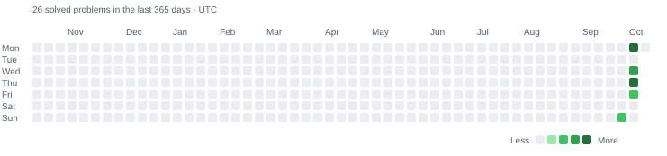

<div id="Intro" align="center">

   <h1>LeetCode Notebook</h1>

   <p><strong>Solve. Experiment. Understand.</strong></p>
   <p>Solutions and personal Jupyter notebooks, together in one place.</p>

   <p>
   <a href="#activity">Activity</a> ·
   <a href="#solutions">Latest solutions</a> ·
   <a href="./solutions">All problems</a> ·
   <a href="#notebooks">Notebooks</a> ·
   <a href="#automation">Automation</a>
   </p>

   

</div>

---

<div id="Activity" align="center">

   ### Activity

   

   Each square represents one of the **last 365 days in UTC**, arranged in seven
   weekday rows. Darker green means more solved problems. Counts use the stored
   solution timestamp for each problem in the full collection, not just the ten
   shown below. Each problem contributes its latest stored solution date;
   organizer commits and notebook edits do not add activity.
</div>

---

<div id="Solutions" align="justify">

   ### Solutions

   Expand the table to see the **10 most recently solved problems**.
   Browse the [solutions directory](./solutions) for the full collection.

   Results and ordering come from the original solution commits. Notebook edits
   do not change a problem's position. Difficulty is read from each problem's
   local README; unavailable values are shown as **—**. Use **💻** to open the
   submitted code and **📝** to open your notebook.

   <details>

   <summary align="center"><strong>Latest 10 solved problems</strong></summary>

<!-- START_TABLE -->

| ID | Problem | Time | Memory | Difficulty | Tags |
| --- | --- | --- | --- | --- | --- |
| 999 | [Test Problem](./solutions/Unknown/999-test-problem) [💻](./solutions/Unknown/999-test-problem/solution.py) [📝](./solutions/Unknown/999-test-problem/notes.ipynb) | 12 ms (85.00%) | 19.3 MB (32.95%) | — | — |
| 14 | [Longest Common Prefix](./solutions/Easy/14-longest-common-prefix) [💻](./solutions/Easy/14-longest-common-prefix/longest-common-prefix.py) [📝](./solutions/Easy/14-longest-common-prefix/notes.ipynb) | 0 ms (100.00%) | 19.3 MB (32.95%) |  |    |
| 2058 | [Concatenation of Array](./solutions/Easy/2058-concatenation-of-array) [💻](./solutions/Easy/2058-concatenation-of-array/concatenation-of-array.py) [📝](./solutions/Easy/2058-concatenation-of-array/notes.ipynb) | 3 ms (18.61%) | 19.3 MB (79.13%) |  |   |
| 50 | [Pow(x, n)](./solutions/Medium/50-powx-n) [💻](./solutions/Medium/50-powx-n/powx-n.py) [📝](./solutions/Medium/50-powx-n/notes.ipynb) | 0 ms (100.00%) | 19.4 MB (87.37%) |  |   |
| 13 | [Roman to Integer](./solutions/Easy/13-roman-to-integer) [💻](./solutions/Easy/13-roman-to-integer/roman-to-integer.py) [📝](./solutions/Easy/13-roman-to-integer/notes.ipynb) | 11 ms (14.09%) | 19.3 MB (59.82%) |  |    |
| 66 | [Plus One](./solutions/Easy/66-plus-one) [💻](./solutions/Easy/66-plus-one/plus-one.py) [📝](./solutions/Easy/66-plus-one/notes.ipynb) | 0 ms (100.00%) | 19.4 MB (19.94%) |  |   |
| 202 | [Happy Number](./solutions/Easy/202-happy-number) [💻](./solutions/Easy/202-happy-number/happy-number.py) [📝](./solutions/Easy/202-happy-number/notes.ipynb) | 0 ms (100.00%) | 19.4 MB (25.48%) |  |     |
| 48 | [Rotate Image](./solutions/Medium/48-rotate-image) [💻](./solutions/Medium/48-rotate-image/rotate-image.py) [📝](./solutions/Medium/48-rotate-image/notes.ipynb) | 0 ms (100.00%) | 19.2 MB (69.63%) |  |    |
| 898 | [Transpose Matrix](./solutions/Easy/898-transpose-matrix) [💻](./solutions/Easy/898-transpose-matrix/transpose-matrix.py) [📝](./solutions/Easy/898-transpose-matrix/notes.ipynb) | 0 ms (100.00%) | 20 MB (15.58%) |  |    |
| 2903 | [Insert Greatest Common Divisors in Linked List](./solutions/Medium/2903-insert-greatest-common-divisors-in-linked-list) [💻](./solutions/Medium/2903-insert-greatest-common-divisors-in-linked-list/insert-greatest-common-divisors-in-linked-list.py) [📝](./solutions/Medium/2903-insert-greatest-common-divisors-in-linked-list/notes.ipynb) | 12 ms (59.37%) | 23.1 MB (7.08%) |  |    |

<!-- END_TABLE -->

</details>

</div>

--- 

<div align="justify">

   ### Notebooks

   Every problem lives in `solutions/Easy/`, `solutions/Medium/`, or `solutions/Hard/`
   under its `<id>-<slug>/` folder, with its code, problem statement,
   and a **notes.ipynb** notebook.

   Use the notebook to write your own implementations, explain your reasoning,
   compare approaches, and try examples. Each new notebook contains a Markdown
   cell and an empty Python code cell. GitHub can preview it directly through the
   **📝** link above. Problems without a recognized difficulty are kept in
   `solutions/Unknown/` until their local README is completed.

   To edit and run notebooks locally, open them in VS Code with Jupyter support,
   or use JupyterLab:

   ```bash
   python3 -m pip install jupyterlab
   jupyter lab
   ```

   Existing notebooks are never overwritten. When migrating an older `notes.md`,
   its text is copied into the notebook before the Markdown file is removed.
   If both files already exist, both are preserved.

</div>

---

<div id="Automation" align="justify">

   ### Automation

   Difficulty comes from each problem's local README. LeetCode tags are fetched
   by `scripts/fetch_tags.py` and stored in `scripts/leetcode_cache.json` by slug.
   Every request is saved immediately, including errors and empty tag lists;
   cached entries are not requested again automatically.

   ```bash
   python3 scripts/organizer.py
   ```

   The workflow currently runs on the **test** branch for solution changes, and
   can also be started manually from GitHub Actions.

   1. Move incoming problems into `solutions/<Difficulty>/`, preserving notebooks
      when LeetSync submits a new version of an existing problem.
   2. Create missing notebooks and preserve the original solution commit in
      `.leetsync.json`.
   3. Commit each changed problem using its original LeetSync message.
   4. Update the tag cache, SVG activity heatmap, and latest-ten table in a
      separate `Update README` commit.

   All automation uses only the Python standard library. No Matplotlib, pandas,
   or other third-party packages are required. The heatmap is generated directly
   as SVG in `assets/heatmap.svg`.

   Configure Git's `user.name` and `user.email` before running locally.
   Incoming solutions must already be committed. The script creates local commits;
   GitHub Actions pushes them after a successful run.

   Repeated runs on the same day with unchanged files create no new commits.
   Conflicting notebooks are preserved for manual resolution, and unrelated staged files are excluded.
   README.md is the base template: edit headings, descriptions, section order,
   the collapsible section, and the activity image link directly here.
   Inside the `START_TABLE` / `END_TABLE` HTML comments, the organizer preserves
   the two table header lines exactly and replaces only the problem rows.
   Keep the six columns in their existing order; their labels can be renamed.
   The header and rows share a marker block because an HTML comment between them
   would break Markdown table rendering. Keep one marker pair, even when moving
   the Solutions section. The activity script updates only `assets/heatmap.svg`,
   not the Activity section in this file.

</div>

---

<div id="tagsColors" align="justify">

   ### Tags and colors

   Tag fetching can also run separately:

   ```bash
   python3 scripts/fetch_tags.py                 # Only uncached problems
   python3 scripts/fetch_tags.py --retry-errors  # Retry cached failures
   python3 scripts/fetch_tags.py --refresh       # Refresh every problem
   ```

   Edit `scripts/tag_colors.json` to customize tag and difficulty colors.
   Unlisted tags use a stable color from the configured palette. The organizer
   generates local SVG badges, so displaying colors requires no external badge service.

   To rebuild local files without network requests or Git commits:

   ```bash
   python3 scripts/organizer.py --offline --no-commit
   ```

</div>